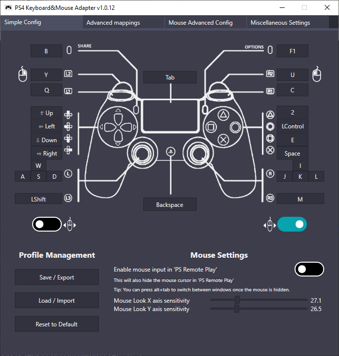
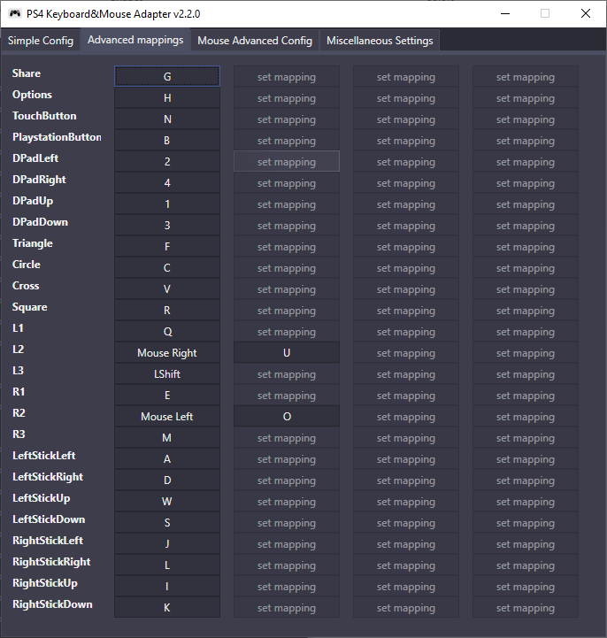
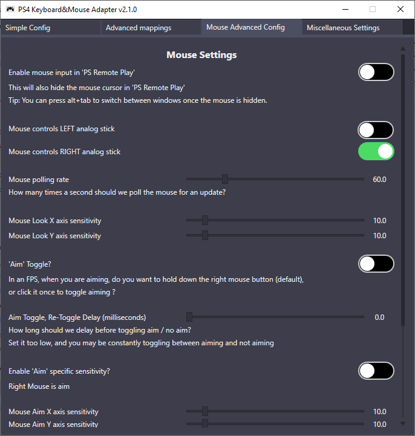
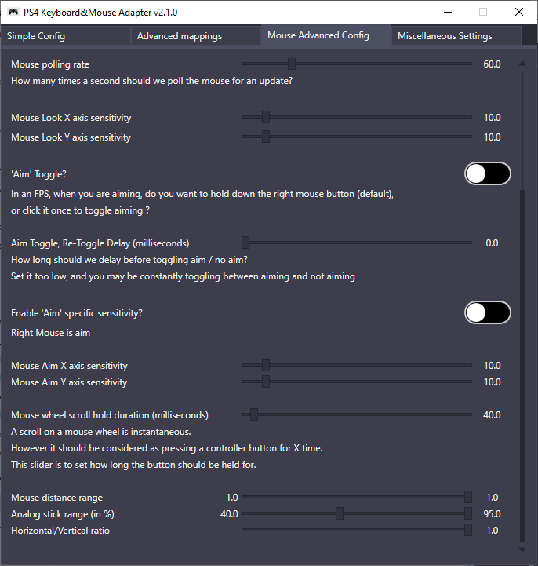
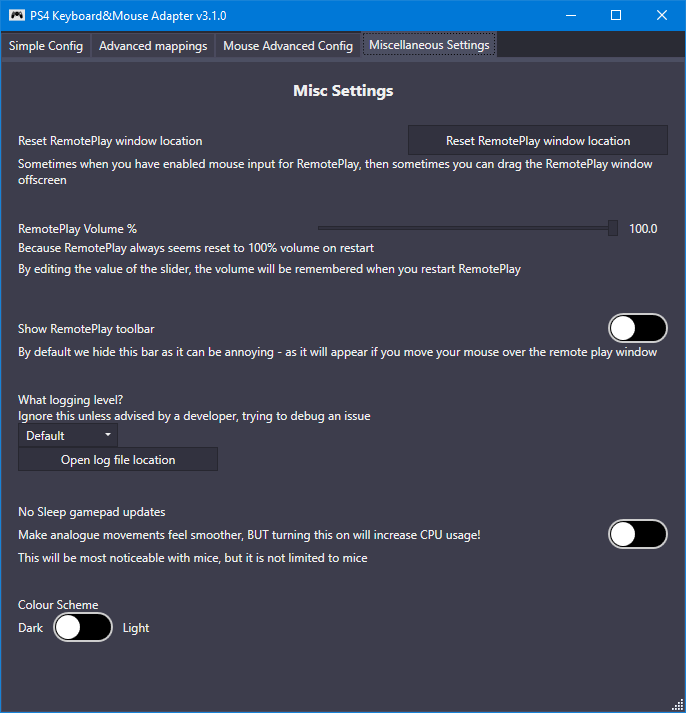

# PS4 Keyboard and Mouse Adapter 
Disclaimer: This project is not endorsed or certified by Sony, Playstation or any of their partners.

## UI

Click the images for bigger views

## DOWNLOAD
:rocket: Click Download!--> [here (v2.0.0)](https://github.com/starshinata/PS4-Keyboard-and-Mouse-Adapter/releases/download/2.0.0/Setup.exe)

## Troubleshooting
see [here](documentation/troubleshooting.md)

## Frequently Asked Questions
see [here](documentation/frequently-asked-questions.md)

## DISCORD
Try our discord here https://discord.gg/zH4b8p4 where you can either suggest ideas or ask other members for help.

## To-do list
* Explicit error message box for when mappings.json is missing or invalid   Currently it (kinda) silently fails unless you open it via a command line.
* Detect when the user does have a DS4 controller plugged in ... and ask user to unplug it
* some game need to detect you shaking the controller, need to figure out how to handle/emulate that
* touchpad needs more work :(
* make DS4 emulation optional
* support for analog input like from a controller stick, controller trigger, or Steering wheel
* supporting ps5
* support linux/mac 
* support chaikis

## Documentation
All documentation [here](documentation/)

But some popular topics are
* [Glossary and Terms](documentation/glossary-and-terms.md)
* [Mouse Configuration](documentation/mouse-configuration.md)
* [Troubleshooting](documentation/troubleshooting.md)
* [Version History](documentation/version-history.md)

## Credits

- [PS4Macro](https://github.com/komefai/PS4Macro) - Big thanks to komefai for making and open-sourcing this tool. Komefai is MIA for 2 years and his repo is not supported anymore but you can still write pretty good bots with it, definitely check it out if you are into that kind of stuff
- [EasyHook](https://easyhook.github.io) - The best tool for Windows API hooking. Works flawlessly - from the assembly injection, to the hook trampoline code. ~~I haven't had a single problem with it~~ I had one but that doesn't make EasyHook any less cool
- [Jays2Kings/DS4Windows](https://github.com/Jays2Kings/DS4Windows) - don't need to explain that one
- [soulehshaikh9](https://github.com/soulehshaikh99/self-signed-certificate-generator) for pfx certificate generator

