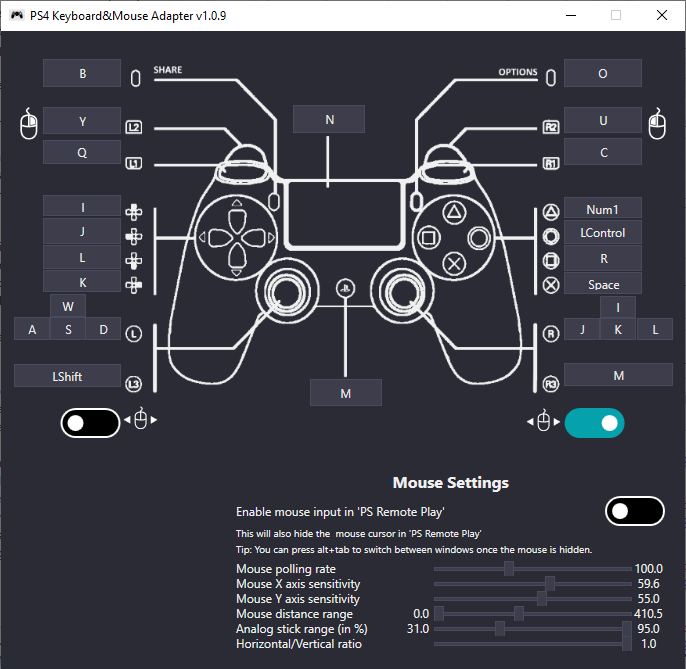

# PS4 Keyboard and Mouse Adapter 
Disclaimer: This project is not endorsed or certified by Sony, Playstation or any of their partners.

## DISCORD
Try our discord here https://discord.gg/zH4b8p4 where you can either suggest ideas or ask other members for help.

## DOWNLOAD
:rocket: Click --> [here (v1.0.8)](https://github.com/starshinata/PS4-Keyboard-and-Mouse-Adapter/releases/download/1.0.8/Setup.exe) <-- to Download!

## How to use
1. Do NOT plug your DS4 controller into your PC while using this tool. If it is plugged already, unplug it because it will interfere with the device emulation.
2. Make sure you've enabled remote play from your PS4's settings menu. To do that:
  * Go to your PS4, select (Settings) -> [Remote Play Connection Settings], and then select the checkbox for [Enable Remote Play].
  * To activate it as your primary PS4, select  (Settings) -> [Account Management] -> [Activate as Your Primary PS4] -> [Activate].
3. Download and run the setup from the download link above. It will automatically do all the configuration stuff for you
4. If you want 0 lag, connect your PS4 to your TV/Monitor and watch the game from there (thus NOT from the Remote Play app)

## Mouse Config
Read [mouse-configuration.md](documentation/mouse-configuration.md)

## Troubleshooting
Read [developers-notes.md](documentation/troubleshooting.md)

## To-do list
* Explicit error message box for when mappings.json is missing or invalid   Currently it (kinda) silently fails unless you open it via a command line.
* Create and switch between multiple mapping profiles to make configuration easy when playing multiple games  I am thinking of  being able to save and load mappings.json files
* Map multiple keys to the same button
* supporting ps5
* support linux/mac 
* support chaikis

## Version History
### v 1.0.10
* fixed an issue where we were unintentionally using extra CPU

### v 1.0.9
* Disclaimer: this version seems to have an increase in CPU usage, if thats a problem please use v1.0.8 instead.
* Fixed image render so controller image is smoothly scaled (looks less janky)
* Fixed issue where 'PS Remote Play' was still taking input, even though it wasn't focused
* Added mappings for PS Button and Touch button
* Added Keyboard mappings for right stick
* Added mouse poll rate settings
* Updated mouse anchoring logic so it is harder for you to click out of 'PS Remote Play' (still theoretically possible to click out of 'PS Remote Play', if you experience this issue try increasing the mouse poll rate, or file an issue).   We specifically recognise where 'PS Remote Play' window is and anchor to the centre of that - previously it was a random (not strictly random but it didn't have any obvious significance) point on your primary monitor
* Added switches to let user set which stick takes input from the mouse.  You could technically have move sticks controlled by the mouse ... I WOULD NOT recommend both sticks bound to the mouse!
* Added more documentation
* Lots of refactorings to make the code cleaner.

### v 1.0.8
* Updated paths for the newest version of Sony's Remote Play app

### v 1.0.7
* Mapping from mouse to analog stick is now configurable
* New UI
* Bug fixes

### v 1.0.6
* Remote Play toolbar used to pop up at the bottom of the screen every time the mouse is moved, not anymore! The toolbar hides as soon as the mouse is hidden.
* Fixed a bug that assumed English system language when looking for Remote Play installation directory

### v 1.0.5
* Added mappings for DPad up, left, down, right

### v 1.0.4
* Added configurable mappings for L2, R2, and R3
* Fixed a bug where customized mappings are not saved between sessions
* Mouse movement feels much more smooth

### v 1.0.3
* Added mappings for L1, R1, L3, R3, and Touchpad buttons
* Various bug fixes

### v 1.0.2
* Fixed a bug where the updater was leaking memory and crashing the app after some time
* Fixed a startup injection error that was happening from time to time due to concurrency issues

### v 1.0.1
* First release

## Notes for Developers
Read [developer-notes.md](documentation/developer-notes.md)

## Credits

- [PS4Macro](https://github.com/komefai/PS4Macro) - Big thanks to komefai for making and open-sourcing this tool. Komefai is MIA for 2 years and his repo is not supported anymore but you can still write pretty good bots with it, definitely check it out if you are into that kind of stuff
- [EasyHook](https://easyhook.github.io) - The best tool for Windows API hooking. Works flawlessly - from the assembly injection, to the hook trampoline code. ~~I haven't had a single problem with it~~ I had one but that doesn't make EasyHook any less cool
- [Jays2Kings/DS4Windows](https://github.com/Jays2Kings/DS4Windows) - don't need to explain that one
- [soulehshaikh9] (https://github.com/soulehshaikh99/self-signed-certificate-generator) for pfx certificate generator
