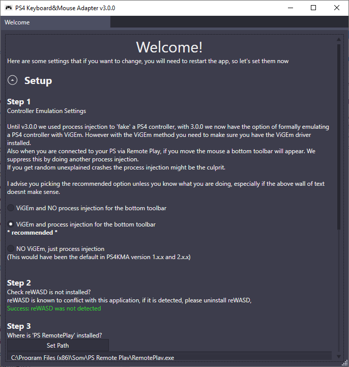
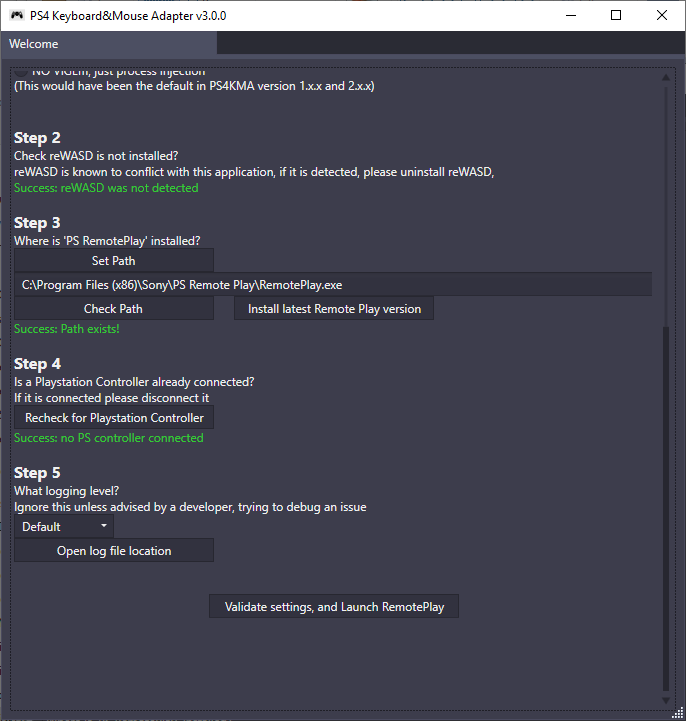
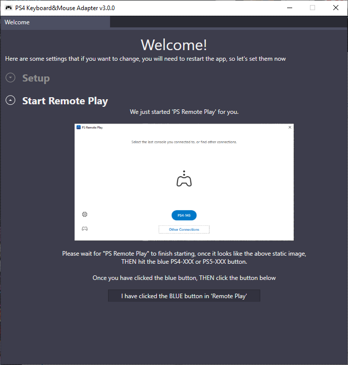
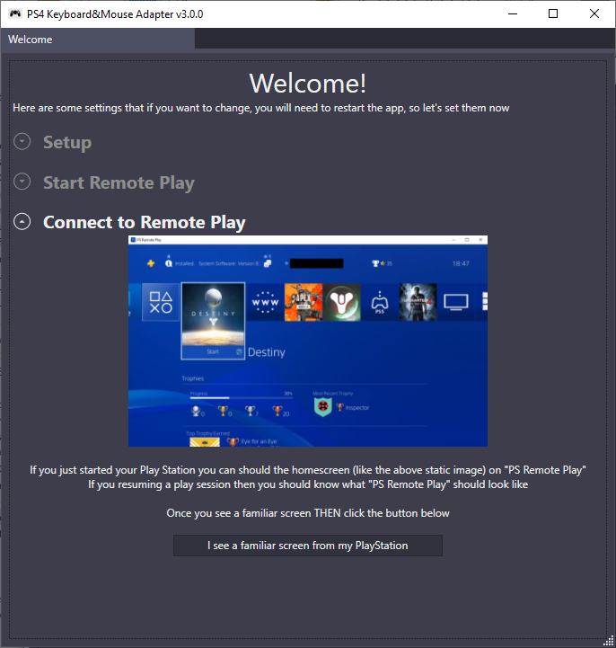

# PS4 Keyboard and Mouse Adapter 
Disclaimer: This project is not endorsed or certified by Sony, Playstation or any of their partners.

## UI

Click the images for bigger views

Welcome Screen  

Main Adapter  

## DOWNLOAD
:rocket: Click Download!--> [here (v2.2.3)](https://github.com/starshinata/PS4-Keyboard-and-Mouse-Adapter/releases/download/2.2.3/application-setup.exe)

## Troubleshooting
see [here](documentation/troubleshooting.md)

## Frequently Asked Questions
see [here](documentation/frequently-asked-questions.md)

## DISCORD
Try our discord here https://discord.gg/zgveKtme5s where you can either suggest ideas or ask other members for help.

## To-do list
* some games need to detect you shaking the controller, need to figure out how to handle/emulate that
* touchpad needs more work :(
* support for analog input like from a controller stick, controller trigger, or Steering wheel
* supporting ps5 (its a bit hit or miss atm)
* support chiaki https://git.sr.ht/~thestr4ng3r/chiaki
* support linux/mac 

## Documentation
All documentation [here](documentation/)

But some popular topics are
* [Glossary and Terms](documentation/glossary-and-terms.md)
* [Mouse Configuration](documentation/mouse-configuration.md)
* [Troubleshooting](documentation/troubleshooting.md)
* [Version History](documentation/version-history.md)

## Shoutouts

* [DS4Windows](https://github.com/Ryochan7/DS4Windows) - don't need to explain that one
* [EasyHook](https://easyhook.github.io) - The best tool for Windows API hooking.
* [PS4Macro](https://github.com/komefai/PS4Macro) - Big thanks to komefai for making and open-sourcing this tool. Komefai is MIA since 2018 and his repo is not supported anymore but you can still write pretty good bots with it, definitely check it out if you are into that kind of stuff
*[PS4RemotePlayInterceptor](https://github.com/komefai/PS4RemotePlayInterceptor) a module by Komefai used in PS4Macro
* [soulehshaikh9](https://github.com/soulehshaikh99/self-signed-certificate-generator) for pfx certificate generator
* [ViGEm.NET](https://github.com/ViGEm/ViGEm.NET) - to help with emulation in v3.0.0+
