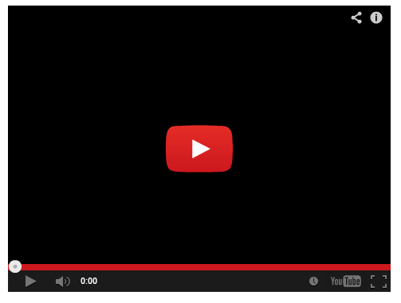

# PS4 Keyboard and Mouse Adapter 
Disclaimer: This project is not endorsed or certified by Sony, Playstation or any of their partners.

## UI

Click the images for bigger views

Welcome Screen  

Main Adapter  

## DOWNLOAD
:rocket: Click Download!--> [here (v.3.1.0)](https://github.com/starshinata/PS4-Keyboard-and-Mouse-Adapter/releases/download/3.1.0/application-setup.exe)

## Troubleshooting, Frequently Asked Questions, and Documentation

see [troubleshooting](documentation/troubleshooting.md)  
see [frequently-asked-questions](documentation/frequently-asked-questions.md)

All other documentation [here](documentation/)

Video for people who need it  

## DISCORD
Try our discord here https://discord.gg/zgveKtme5s where you can either suggest ideas or ask other members for help.

## To-do list
* some games need to detect you shaking the controller, need to figure out how to handle/emulate that
* touchpad needs more work :(
* support for analog input like from a controller stick, controller trigger, or Steering wheel
* supporting ps5 (its a bit hit or miss atm)
* support chiaki https://git.sr.ht/~thestr4ng3r/chiaki
* support linux/mac 

## Shoutouts

(in alphabetical order)
* [DS4Windows](https://github.com/Ryochan7/DS4Windows) - don't need to explain that one
* [EasyHook](https://easyhook.github.io) - The best tool for Windows API hooking.
* [PS4RemotePlayInterceptor](https://github.com/komefai/PS4RemotePlayInterceptor) a module by used in [PS4Macro](https://github.com/komefai/PS4Macro). 
  Big thanks to [komefai](https://github.com/komefai).  
  If this wasn't available PS4KMA might not have happened.
* [soulehshaikh9](https://github.com/soulehshaikh99/self-signed-certificate-generator) for pfx certificate generator
* [ViGEm.NET](https://github.com/ViGEm/ViGEm.NET) - (to help with emulation in v3.0.0+) Big thanks to [nefarius](https://github.com/nefarius) for making this. 
