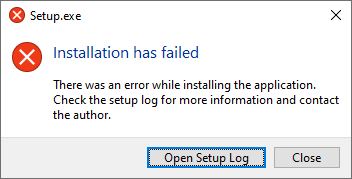

# Troubleshooting

## Recommended user environment

* If you have Rewasd installed, please uninstall it  
  https://www.rewasd.com/  
  Rewasd being installed can cause interference with this application

* Make sure that "PS Remote Play" is closed before starting the adapter

* Do not start "PS Remote Play" yourself  
  If you start "PS Remote Play" yourself, the adapter be able to connect to that instance of remote play  
  (PS4KeyboardAndMouseAdapter will start "PS Remote Play" once we detect where it is installed)  

* If you have a DS4 or DS5 controller/gamepad, unplug it from computer  
  Either being plugged in can cause interference with this application
  
* PS4 is connected to your router via Ethernet cable  
  (this reduces lag, and make your PS4 more consistently find-able from the "PS Remote Play" application)

* Use video from the PS4  
  Plug a HDMI cable into your PS4, and connect the other end into your monitor/TV even when using remote play  
  (If you choose to use the video from the "PS Remote Play" then you are adding delay/lag which is generally undesired)

* The PS4 you are trying to connect to has Remote play enabled  
  PS4 ->  select (Settings) -> [Remote Play Connection Settings], and then select the checkbox for [Enable Remote Play].

* The PS4 you are trying to connect to is set as your PSN account's Primary PS4  
  PS4 -> select (Settings) -> [Account Management] -> [Activate as Your Primary PS4] -> [Activate].

* PS Remote Play connects via a code  
  see [Playstation 4: add a device](https://manuals.playstation.net/document/en/ps4/settings/adddevice.html)  
  This should mean you are using your local network, instead of going over the internet  
   
  To confirm this, on your PS4 `Settings -> Remote Play Connection Settings --> Connection History --> select a connection`  
  After selecting a connection, you will see "Connection Method". If it says "Nearby" instead of "Via Internet", that should be local network.

* PS Remote Play application has its video settings set to the lowest  
  (This should reduce the the amount of data your PS4 has to send, and how much your Remote Play application has to receive)  
  Goto "PS Remote Play" application (without an active console connected) -> "Settings" via the cog symbol -> "Video Quality for Remote Play" tab -> pick either PS4 or PS5 > Resolution set to lowest

## Problems and fixes
#### (Installation) "Installation failed"

Click on "Open Setup Log" and look for something meaningful, if you cant find something, then share the log via a github issue (https://github.com/starshinata/PS4-Keyboard-and-Mouse-Adapter/issues), or on our discord (https://discord.gg/zH4b8p4)

#### (Installation Log) "Could not write to C:\Users\\{USER}\AppData\Local\PS4KeyboardAndMouseAdapter" or "Couldn't write out staging user ID, this user probably shouldn't get beta anything"
Can you check three things,
* PS4KeyboardAndMouseAdapter.exe is not running
* PS Remote play is not running
* your antivirus hasnt quarantined PS4KeyboardAndMouseAdapter.exe (we have been flagged as a virus because we arent vetted by a big/known/trusted corporation).   We submit executable scans to https://www.virustotal.com/ for every release, and they have yet to detect a real threat.

If that doesnt resolve it, please delete the folder "C:\Users\\{USER}\AppData\Local\PS4KeyboardAndMouseAdapter", restart your PC, then try again

#### (Runtime) Application says "need to install remote play" but I already have it installed
If you are on PS4KeyboardAndMouseAdapter v1.0.7 or lower, you need to upgrade to a newer version. Sometime in October 2020 Sony issued a new version of "PS Remote Play" to support PS5, that broke some things in older versions of our application.

#### (Runtime) Presentation Framework-SystemCore Error
`An unhandled exception occurred in a component in your Microsoft .NET Framework application.  If you click Continue Y, the application will ignore this error and try to continue.  Could not load the "Presentation Framework-SystemCore, Version = 4.0.0.0. Culture = neutral. PublicKey Token = b77a5c561934e089 'or its integrated code or one of its dependencies. The module was expected to contain an integrated code manifest.`

Er, wish I knew.  
Feel free to raise an issue at https://github.com/starshinata/PS4-Keyboard-and-Mouse-Adapter/issues, or message pancakeslp on our discord https://discord.gg/zH4b8p4
