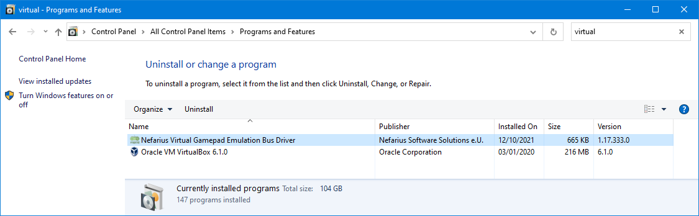

# ViGEm

## What is ViGEm
ViGEm stands for "**Vi**rtual **G**amepad **Em**ulation" Framework.

It is a way of emulating a console controller (PS4 DualShock 4, or Xbox 360 controller).

For more information see https://vigem.org/

## Installation
Goto https://github.com/ViGEm/ViGEmBus/releases and select the installer file  
(Or if that repo is unavailable we have a backup at https://github.com/starshinata/PS4-Keyboard-and-Mouse-Adapter/tree/master/installers/vigemBusDriver/)

## Uninstallation
* Goto ` Control Panel > Programs and Files`
* Then search for **"Virtual Gamepad Emulation Bus Driver"**  
    
  and if you don't find it search for **"ViGEm Bus Driver"**  
  (what you are searching for depends on the version of ViGEm you installed)
  
* Select the application and hit uninstall and follow the prompts.
